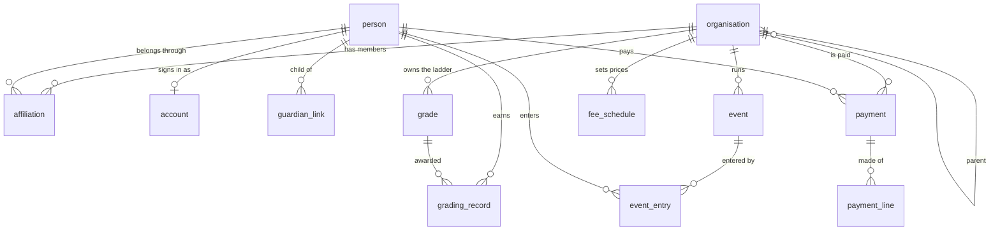

# Honbu entities

What the platform keeps, grouped by purpose. The schema is `db/install/schema.sql` (84 tables); this is the map of it.
The relationships below come from the real foreign keys.

## Four ideas that explain most of it

1. **One tree of organisations.** A federation has regions, regions have clubs. Everything that belongs somewhere points at
   `organisation`, and a person's reach is "this organisation and everything beneath it" (an `ltree` path). The leaf is
   always a **club**; what a federation *calls* it (Dojo, Dojang, Academy, Gym) is vocabulary in settings, not a table.
2. **People are not accounts.** A `person` is somebody on a roll (a child, a member who never logs in). An `account` is a
   sign-in, and belongs to a person. A child is linked to a guardian through `guardian_link`.
3. **History belongs to the person, not the club.** Grades, titles, qualifications and attendance are dated records on
   the person. Current grade is *derived* (the `person_current_grade` view), never stored on the person.
4. **Settings are inherited.** `organisation.settings` holds region (currency, language, age of adulthood, tax),
   vocabulary, kinds of event and look. The nearest ancestor that has said wins, so a club only sets what differs.

## The core

## Organisations and people

| Table | What it is |
|---|---|
| `organisation` | A federation, region or club. Tree via `parent_id` and `path`. Holds `settings`. |
| `club_profile` | A club's public detail: venue, address, hours blurb, whether its page is published. |
| `person` | Somebody on a roll. Name, date of birth, gender, number. |
| `person_private` | The sensitive part of a person (encrypted): emergency contact and similar. |
| `affiliation` | A person's membership of an organisation, with a role (member, instructor, assistant, official, supporter), dates, paid-until, status, exemption. |
| `guardian_link` | A parent or guardian responsible for a child. |
| `account` | A sign-in, belonging to a person. |
| `grant_role` | A role an account holds at an organisation (owner, administrator, registrar, teacher). |
| `member_document` | A document filed against a person (certificate, consent, receipt). |

## Grades, titles and qualifications

| Table | What it is |
|---|---|
| `grade` | A rung on a federation's ladder (kyu, dan, belt, level): order, label, whether it is a dan grade, usual time to the next. |
| `grade_authority` | Who may award which grades, with what panel, and any title a panelist must hold. |
| `grading_record` | One grading that happened. Permanent, dated, belongs to the person. |
| `grading_event`, `grading_entry` | A grading day and who sat it, with the result. |
| `certificate_counter` | Numbers certificates per organisation. |
| `title`, `title_award` | Honorary titles (Shihan, Renshi…) and who holds them. |
| `qualification`, `qualification_award`, `qualification_reminder` | Things that lapse: first aid, police vetting, coaching badges. Expiry and reminders. |
| `federation_declaration`, `declaration_signing` | A statement the federation asks members to sign, and who signed it and when. |
| `club_form`, `form_response` | Forms a club builds (waiver, photo consent, medical) and the answers. |

## Training

| Table | What it is |
|---|---|
| `training_session` | A class on the weekly timetable. |
| `attendance` | Who came to a session on a day. |
| `class_booking` | A place booked in a class with limited spaces. |
| `school_term`, `term_offer`, `term_enrolment` | Term-based programmes: the term, its price, and who enrolled. |

## Events and tournaments

| Table | What it is |
|---|---|
| `event` | A camp, grading, tournament, seminar or meeting. Owner, visibility, publish-upward state. |
| `event_detail` | How an event is announced (banner words, dates). |
| `event_fee`, `entry_price` | What entering costs, including price per number of entries. |
| `event_entry` | A person (or guest) entered in an event. |
| `entry_selection`, `entry_consent` | Which disciplines and divisions they chose, and the consent given. |
| `event_discipline`, `event_division` | Kata, kumite, weight and age divisions. |
| `club_gallery` | A club's photo strip, filed by year and event. |

## Money

| Table | What it is |
|---|---|
| `fee_schedule` | A club's prices: label, amount, period, who it applies to. |
| `payment` | A request for money or a payment received. Payee, payer, currency, status, receipt number. |
| `payment_line` | What a payment is for (club fee, tournament entry, grading, uniform, equipment). |
| `payment_agreement` | A member letting a club charge a saved method automatically. |
| `invoice`, `invoice_line` | What a parent organisation bills a child organisation. |
| `receipt_counter` | Numbers receipts per organisation and year. |

## Shop

`product` (an item, owned by the federation or a club), `product_listing` (a club hiding a national item or setting its own
price), `shop_order`, `shop_order_line`.

## Growth

`newcomer` and `newcomer_attendance` (the start-any-week trial path), `enquiry` (a contact or trial enquiry), `member_trial`,
`referral_code`, `referral`, `referral_reward`.

## Messaging and notifications

`message` (what a club sent and to which audience), `message_recipient` (who it reached), `email_preference` (opt-outs),
`push_subscription` (a phone or browser that wants notifications).

## Website and content

| Table | What it is |
|---|---|
| `page`, `page_revision` | Pages, with every saved version. |
| `article` | News, with publish-upward approval. |
| `asset`, `asset_blob` | Images and files, and their bytes. |
| `brand` | Colours, fonts and logo tokens. |
| `content_type`, `content_entry`, `content_revision` | Custom content a federation defines (an "Instructor" card, a "Seminar"). |
| `instructor_profile` | An instructor's public bio at a club. |
| `publication`, `rebuild_queue` | What is published and where, and the queue that rebuilds the public site. |
| `redirect`, `internal_link` | Old addresses that must keep working, and links that must not break. |

## Security, audit and integration

`session`, `login_link`, `login_attempt` (passwordless sign-in), `audit_log` (who changed what), `domain_event` (things that
happened, for other systems to react to), `api_token`, `webhook_endpoint`, `webhook_delivery`.

## Rules the data keeps

- A supporter is not a member and has nothing to do with rank.
- A child (under the organisation's age of adulthood) must be linked to a guardian.
- Only someone holding a dan grade can be an instructor.
- Money always names its currency; nothing defaults to one country's.
- Settings and vocabulary are data, so the same code serves every art and country.
